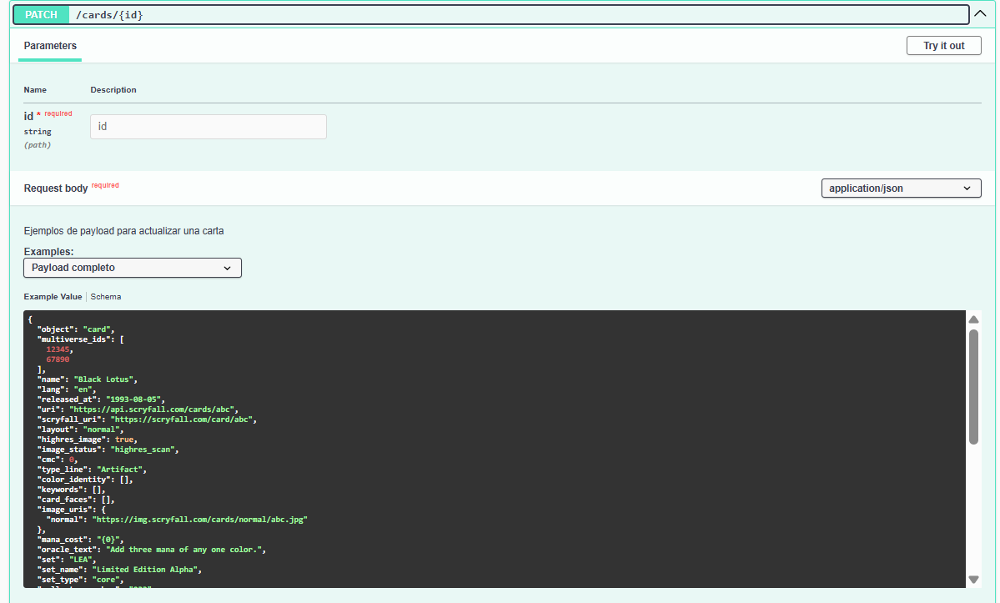
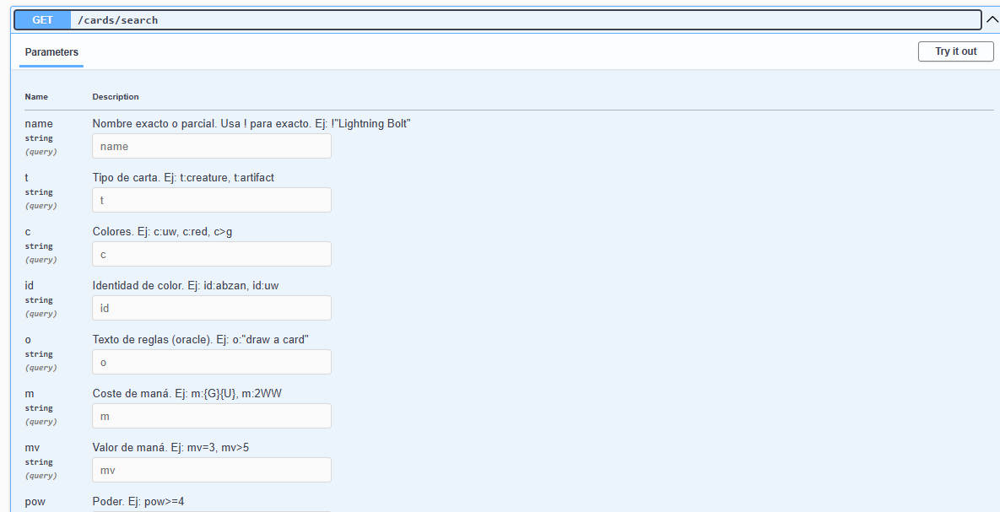
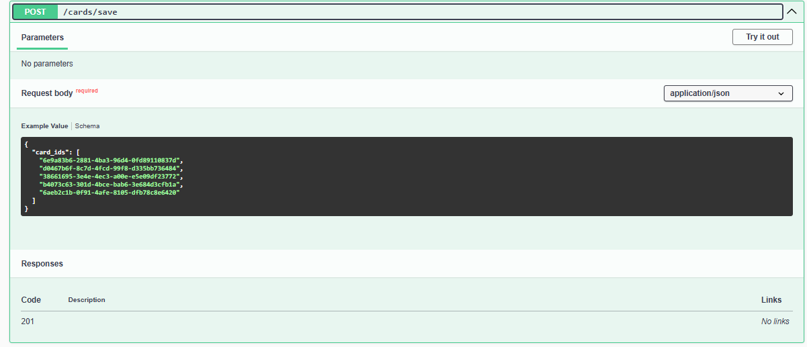

# MTG Card Manager

Backend para gestión y consulta de cartas de Magic: The Gathering usando la API pública de Scryfall y MongoDB.

## Tecnologías principales

- NestJS (TypeScript)
- MongoDB (Mongoose)
- Docker
- Swagger (OpenAPI)
- Jest (testing)

---

## 1. Instalación y setup

### Prerrequisitos

- Docker y Docker Compose
- Node.js >= 18
- pnpm (recomendado) o npm/yarn

### Pasos de instalación

```bash
pnpm install # o npm install / yarn install
```

### Configuración de variables de entorno

Copia el archivo `.env.example` a `.env` y ajusta las variables según tu entorno.

### Levantar base de datos con Docker

```bash
docker compose up -d
```

---

## 2. Uso / Endpoints

### Correr el proyecto

```bash
pnpm run start:dev # o npm run start:dev
```

### URL base

- http://localhost:3000/

### Endpoints principales

- `GET /cards/search` — Buscar cartas por campos avanzados
- `POST /cards/save` — Guardar cartas por IDs de Scryfall
- `PATCH /cards/:id` — Modificar carta existente por ID

### Documentación Swagger

- [http://localhost:3000/api](http://localhost:3000/api)

---

## 3. Ejemplos de uso

### Buscar cartas

```bash
curl "http://localhost:3000/cards/search?name=Black%20Lotus"
```

### Guardar cartas

```bash
curl -X POST http://localhost:3000/cards/save -H "Content-Type: application/json" -d '{"card_ids": ["id1", "id2"]}'
```

### Modificar carta

```bash
curl -X PATCH http://localhost:3000/cards/{id} -H "Content-Type: application/json" -d '{"name": "Nuevo nombre"}'
```

### Respuesta esperada (POST /cards/save)

```json
{
  "result": [
    { "id": "id1", "status": "Guardada" },
    { "id": "id2", "error": "Ya existe en la base de datos" }
  ],
  "stats": {
    "guardadas": 1,
    "ya_existian": 1,
    "no_encontradas": 0
  }
}
```

---

## 4. Testing

### Ejecutar tests unitarios

```bash
pnpm run test # o npm run test
```

### Ver cobertura

```bash
pnpm run test:cov # o npm run test:cov
```

---

## 5. Estructura del proyecto

- `src/cards/` — Módulo principal de cartas (servicio, controlador, DTOs, entidades, integración Scryfall)
- `src/cards/dto/` — DTOs y validaciones
- `src/cards/interfaces/` — Interfaces y tipado fuerte
- `test/` — Pruebas end-to-end
- `.github/instructions/` — Instrucciones y documentación técnica

---

## 6. Tecnologías usadas

- **NestJS** — Framework backend Node.js
- **MongoDB** — Base de datos NoSQL
- **Mongoose** — ODM para MongoDB
- **Docker** — Contenedores y base de datos local
- **Swagger** — Documentación interactiva de la API
- **Jest** — Testing unitario
- **pnpm** — Gestor de paquetes rápido

---

## 7. Extras

### Screenshots de Swagger

#### PATCH /cards/:id


### GET /cards/search


### POST /cards/save


### Diagrama de arquitectura


### Decisiones técnicas

- Separación estricta de lógica de negocio y controladores
- Validación exhaustiva con DTOs y class-validator
- Rate limiting manual para Scryfall
- Respuestas y manejo de errores claros
- Documentación y ejemplos en Swagger
- Testing unitario con mocks para dependencias externas

## 8. Mejoras futuras

- **Logs estructurados con Winston**: Implementar Winston para logging avanzado, niveles de log, persistencia y trazabilidad.
- **Cache con Redis**: Añadir cacheo de respuestas frecuentes (por ejemplo, búsquedas a Scryfall) usando Redis para mejorar el rendimiento y reducir llamadas externas.
- **Autenticación y autorización**: Proteger endpoints sensibles con JWT, Guards o similar.
- **Rate limiting global**: Mejorar el rate limiting usando librerías como `@nestjs/throttler`.
- **Monitorización y métricas**: Integrar herramientas como Prometheus, Grafana o Sentry para monitoreo y alertas.
- **Pruebas e2e más exhaustivas**: Ampliar los tests end-to-end y mocks de dependencias externas.

---
